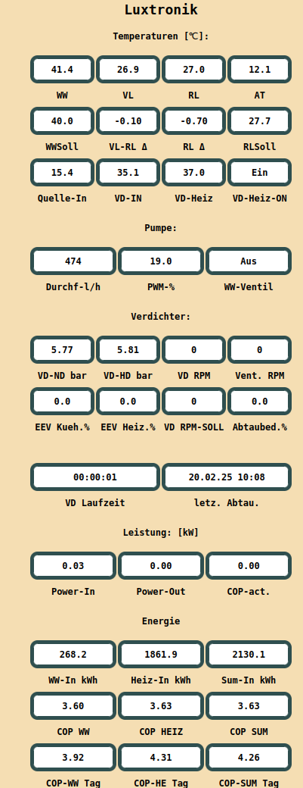
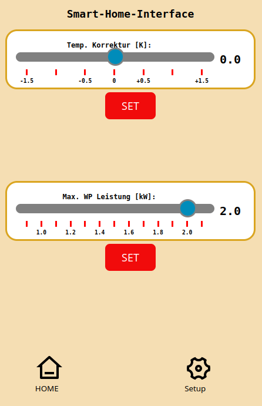
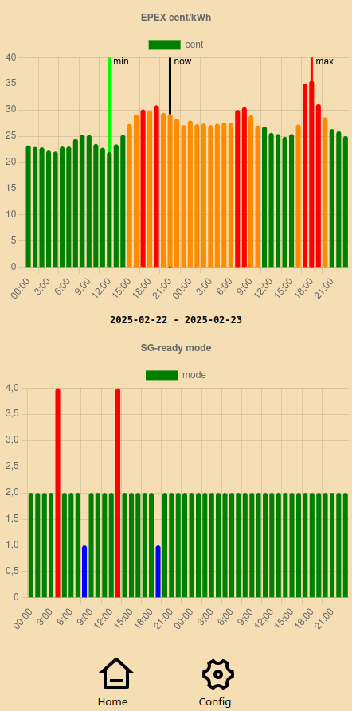
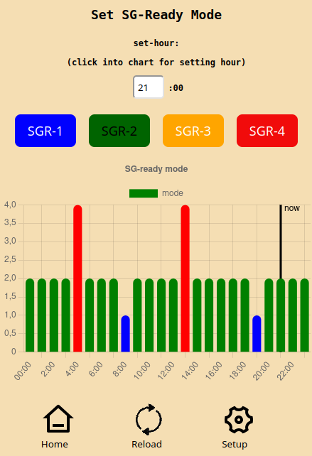
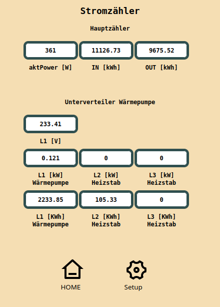
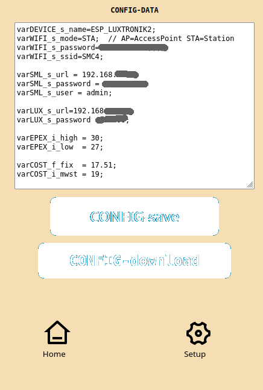
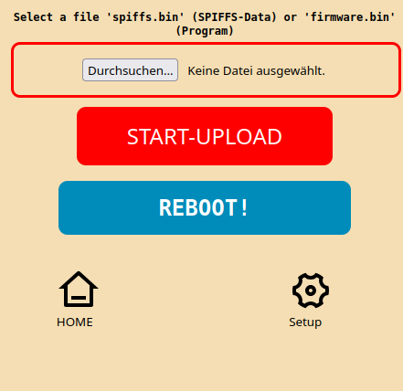

# LUXTRONIK HEATPUMP WEBSERVICE WEB-APP for ESP32 (all variants of ESP32)

ESP32 LUXTRONIK Heatpump Controller Interface based on Websocket (for Heatpumps from alpha-inotec, Novelan, Nibe, Bosch,..)
List and calculate most of the values from Luxtronik on a ESP32 Microcontroller.


(this Version has been developed and tested based on software version V3.90.4, not testet with V2.x, does not work with V1.x)

.. a wild mix of german and (in source code) english.
(if it is usefull for other users there is no problem to communictate at ISSUES or PULL REQUESTS in english)


## Add-Ons:

- Tibber-Puls Adapter Integration
- SGready (Smart-Grid-Ready Relay-Interface) with Hardware or Tasmota or Shelly Relais
- Smart-Home-Interface (SHI) (needs firmware Luxtronik 2.1 >=  V3.90.2)
- Shelly HT3 indoor room temperatur sensor via MQTT
- API and visualisation of EPEX-Price Data including local fix costs and tax
- RS485 Modbus integration for DS100 Energy-Meter (needs extra hardware)

## Highlights:
- online COP calculation (actual, day and sum)
- some extra calculation for delta temperature values
- use HTTP-Get: '/fetch' and '/fetchmeter' for getting CSV-values to home-automation programs 

## todo:

- ~~Add webclient-protocol for temp. +/+ 5Kelvin auto/manual temp. correction based on indoor room temperature (because not possible with WebSocket communication)~~ 
Update: now possible with Smart-Home-Interface !

## Screenshots of Web-App

#### Start-Page


#### Luxtronik detail data
  

#### Smart-Home-Interface (MODBUS TCP)


#### Actual Day-Ahead Price inc. fix-cost and tax (optional)
  

#### View and set (manual or based on EPEX-Values) the SG-ready Interface of Heatpump (optional)
  


#### View Tibber-Pulse or Tasmota SML-Meter values (optional) and DS100 Meter values (optional)
  

#### Text based Config-File


[Link to docu config-file](#config-data)


#### Update Software and Data from Webbrowser (OTG)



## Documentation

### Config-Data
```
varDEVICE_s_name=ESP_LUXTRONIK2;
varWIFI_s_mode=STA;  // AP=AccessPoint STA=Station
varWIFI_s_password=mypassword;
varWIFI_s_ssid=mySSID;

; SML Adapter (Tibber-Pulse or Tasmota SML-Meter)
varSML_s_url = 192.168.0.xx;
varSML_s_password = xxxx-xxxx;
varSML_s_user = admin;

; Luxtronik Web-Interface
varLUX_s_url=192.168.2.xx;
varLUX_s_password =00000;

; EPEX Price (inc. tax)
varEPEX_i_high = 30;
varEPEX_i_low  = 27;

varCOST_f_fix  = 17.51; fixed-price-part per kwh
varCOST_i_mwst = 19;  ; tax (MwSt)

varSG_s_rule1=00,47,1,0,FIX;
varSG_s_rule2=13,21,4,05,EPEX_LOWHOUR;
varSG_s_rule3=37,40,4,04,EPEX_LOWHOUR;

;varSG_s_rule3=15,15,2,0,FIX;
;varSG_s_rule4=01,11,1,02,EPEX_HIGHHOUR;
;varSG_s_rule5=13,23,1,02,EPEX_HIGHHOUR;
;varSG_s_rule6=13,47,2,40,EPEX_HIGHLIMIT;

; SG-ready PINS for direct relay-switch on ESP32-Borad
varSG_s_out1 = GPIO_12; 
varSG_s_out2 = GPIO_10;

; SG-ready Signals for shelly double relay
varSG_s_sg1 = http://192.168.2.25/rpc/Script.Start?id=1;
varSG_s_sg2 = http://192.168.2.25/rpc/Script.Start?id=2;
varSG_s_sg3 = http://192.168.2.25/rpc/Script.Start?id=3;
varSG_s_sg4 = http://192.168.2.25/rpc/Script.Start?id=4;


; SG-Ready Power-Limit with Smart-Meter-Interface
; only for Luxtronik > V2.90.2 
; Power in 0.1kW (10 = 1kW Limit)
varSHI_i_pcsp1 = 10;
varSHI_i_pcsp2 = 11;
varSHI_i_pcsp3 = 13;
varSHI_i_pcsp4 = 18;
```
### Syntax for varSG_s_ruleX

this is a very powerfull rule-based syntax for setting SG-ready-Mode based on time and EPEX-Price. The higher rule overrides the lower rule if there are overlapping conditions. If you need more rules or conditions this could be easy expanded in the source-code of the 'SmartGrid' lib.

Define up to 6 (X=1..6) rules for switching Smart-Grid value 1..4

```varSG_s_rule<x>=<start-hour>,<end-hour>,<SG-Ready-Mode>,<var1>,<RULE>```

* set SG-ready Mode 1..4 if rule is TRUE


| Parameter     | value             |     remark                    |
|---------------|-------------------|-------------------------------|
|start-hour     | 0..47             | values > 24 for next day      |
|end-hour       | 0..47             | values > 24 for next day      |
|               |                   |                               |
|SG-Ready-Mode  | 1..4              | set 'varSG_i_sg1..4'          |
| "  "     "    |   "               | set 'varSHI_i_pcsp1..4        |
|               |                   |                               |
| var1          | 0..47             |                               |
|               |                   |                               |
| RULE          | FIX               |TRUE at: start- until end-hour       |
| RULE          | EPEX_HIGHLIMIT    |TRUE if hour-price >= var1           |
| RULE          | EPEX_LOWLIMIT     |TRUE if hour-price <= var1           |
| RULE          | EPEX_HIGHHOUR     |TRUE for highest-price var1 hours in start-end|
| RULE          | EPEX_LOWHOUR      |TRUE for lowest-price var1 hours in start-end |

EPEX-price ist enduser-price inc fix-costs and all taxes

Examples:

``` varSG_s_rule3=0,47,1,40,EPEX_HIGHLIMIT;```
Set SG-Ready-Mode '1' for all EPEX-Price hours with >=40cnt from 0:00 to next Day (+47) 23:00 

``` varSG_s_rule3=6,12,4,25,EPEX_LOWLIMIT;```
Set SG-Ready-Mode '4' for all EPEX-Price hours with <>=25cnt from 6:00 to 12:00

``` varSG_s_rule3=5,12,4,05,EPEX_LOWHOUR;```
SET SG-Ready-Mode '4' for the 5-hours with the lowest EPEX-price from 5:00 to 12:00

``` varSG_s_rule3=18,23,2,07,EPEX_HIGHHOUR;```
SET SG-Ready-Mode '2" for the 7-hours with the highest EPEX-price from 18:00 to 23:00


